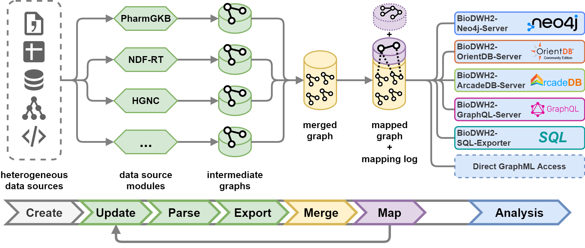

   

# BioDWH2
BioDWH2 is an easy-to-use, automated, graph-based data warehouse and mapping tool for bioinformatics and medical informatics. Whether you need a data warehouse for running research analyses or information systems, BioDWH2 can support you in setting things up.

## Data sources
Multiple data sources are readily available with many more under development or planned. A list of officially supported data sources is provided [here](doc/data_sources.md).

Missing a data source important to you? Feel free to open a discussion [here](https://github.com/BioDWH2/BioDWH2/discussions/categories/data-source-requests)! Want to develop your own data source module? In that case consult the [development documentation](doc/development.md).

## Download
The latest release version of BioDWH2 can be downloaded [here](https://github.com/BioDWH2/BioDWH2/releases/latest).

For using generated data warehouses inside Neo4j please see the separate [BioDWH2-Neo4j-Server repository](https://github.com/BioDWH2/BioDWH2-Neo4j-Server).

## Usage
BioDWH2 is developed to be usable out of the box without any prerequisites except the Java Runtime Environment version 8. The JRE 8 is available [here](https://www.oracle.com/java/technologies/javase-jre8-downloads.html).

For detailed information on how to use BioDWH2 please see the separate [documentation](doc/usage.md).

## Developer docs
If you either want to help in the development of BioDWH2 directly, or write a new data source module please consult the [development documentation](doc/development.md).

## Citing BioDWH2

Coming soon