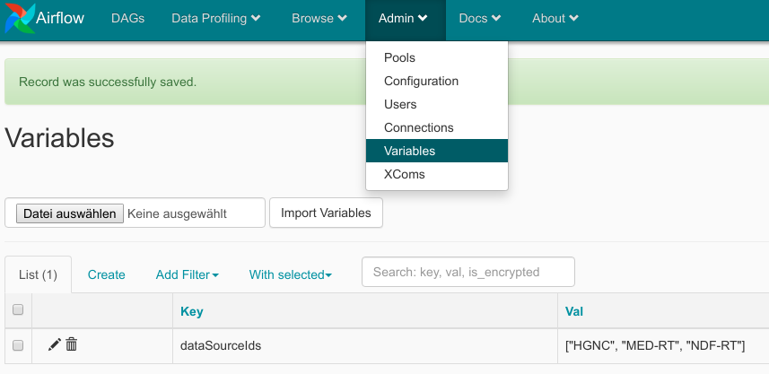

# BioDWH2

## Dockerize & Airflow
In order to run the application through docker the the container can be build with from the dockerfile directory:
```shell script
docker build - t bio_dwh2 .
```

After a successful build the container can be tested with:
```shell script
docker run bio_dwh2 -h
```

Airflow is only defined in the docker-compose.yml in the airflow folder. Since the project does not require heavy  
modifications to airflow itself the container is not build from scratch but from:
> https://github.com/puckel/docker-airflow

After executing:
```shell script
docker-compose up
```
the image will be downloaded and executed.  
In order to function properly the docker-compose and the dags need to be modified to fit 
the the right file system.

docker-compose:
```
volumes:
    - ...
    - ...
    - <host_workspace>:<container_workspace>            # Modify here
    - <host_docker_socket>:<container_docker_socket>    # Modify here
```
example-dag:
```
DockerOperator(
    task_id=...,
    image=...,
    api_version=...,
    auto_remove=...,
    volumes=<host_workspace>:<container_workspace>, # modify here
    command=...,
    docker_url=<docker_socket> # modify here
    network_mode=...
)
```
The main structure of the Dag can be found in the example.py.
The structure of the tasks is:
latest_only >> set_workspace >> configure_workspace >> [generate sources parallel]

To test this dag the sources need to be in the postgress database in airflow:
<p align="center">
  
</p>

These will be set in the configure_workspace step and will be further used to generate the tasks.