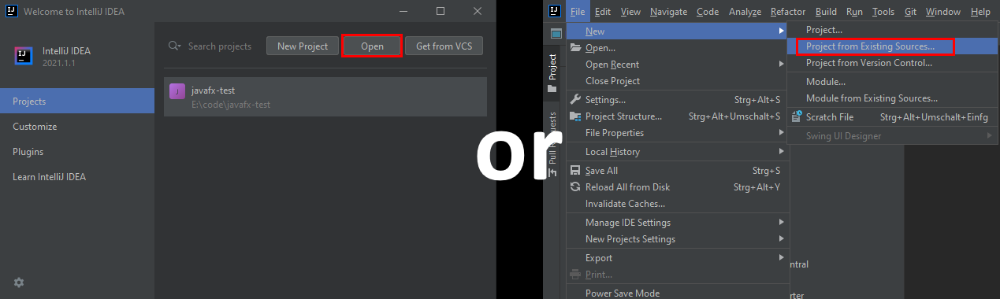
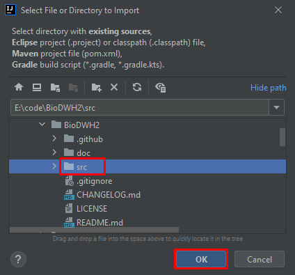
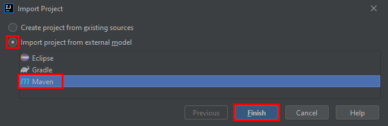

# Setup

For developing BioDWH2 in a consistent way, certain mechanisms are in place to guarantee good code quality. This includes the choice of IDE which in this case is [IntelliJ IDEA](https://www.jetbrains.com/idea/). As an open source project, BioDWH2 can be developed with the free community edition of IntelliJ.

During setup, make sure to install the following plugins:

- Maven integration
- Git integration

Alternatively, the plugins can be installed/enabled under ```Settings > Plugins```.

## Opening the maven project in IntelliJ IDEA

While BioDWH2 is a maven project, IntelliJ IDEA uses it's own project format to store additional information. The following shows how to open the project and keep the maven project intact.

First import the project from existing sources, either from the start screen with ```Open``` or via the menu ```File -> New -> Project from Existing Sources...```.



Browse to the checked out repository of BioDWH2 and select the ```src``` folder.



Select ```Import project from external model``` and as the model ```Maven```.



## Coding style setup

One of the advantages of IntelliJ IDEA is the automated code formatting. This ensures a higher code quality and less merge conflicts. Included in this repository is a coding style configuration file ([CodingStyle.xml](CodingStyle.xml)) which can be directly imported into IntelliJ IDEA. Developers and contributers of BioDWH2 need to adhere to this coding style. The import is very easy. First, go to ```File > Settings > Editor > Code Style > Java```. Click on the cog icon and select ```Import Scheme > Intellij IDEA code style XML```.


With the BioDWH2 scheme imported and selected, click the cog icon again, select ```Copy to Project``` and confirm the overwrite.

Now the automatic code formatting is using the BioDWH2 coding style. Formatting an open code file can be done either by the menu ```Code > Reformat Code``` or the shortcut ```Strg + Alt + L```.

## Creating a new parser module

Creating a new parser module is pretty simple, but for consistency we go through the steps in short. First, right click the project ```src``` folder and select ```New > Module```.


Second, select ```Maven``` as the module type and click ```Next```.


Now enter the artifact id for the new module, all other values are inherited. The artifact id follows the structure ```biodwh2-[a-z]+``` where the suffix is unique and identifying the data source that is processed in this module. Click ```Finish```.


Now your new module should be created and added to the module list. Open the ```pom.xml``` of your module and add the dependencies for the ```biodwh2-core``` module and the ```junit``` unit testing library as follows:

```xml
<?xml version="1.0" encoding="UTF-8"?>
<project xmlns="http://maven.apache.org/POM/4.0.0"
         xmlns:xsi="http://www.w3.org/2001/XMLSchema-instance"
         xsi:schemaLocation="http://maven.apache.org/POM/4.0.0 http://maven.apache.org/xsd/maven-4.0.0.xsd">
    <parent>
        <artifactId>biodwh2</artifactId>
        <groupId>de.unibi.agbi.biodwh2</groupId>
        <version>0.3.7</version> <!-- BioDWH2 version -->
    </parent>
    <modelVersion>4.0.0</modelVersion>

    <artifactId>biodwh2-nameofmodule</artifactId>
    <version>0.1</version>

    <dependencies>
        <dependency>
            <groupId>de.unibi.agbi.biodwh2</groupId>
            <artifactId>biodwh2-core</artifactId>
            <version>${project.parent.version}</version>
        </dependency>

        <dependency>
            <groupId>org.junit.jupiter</groupId>
            <artifactId>junit-jupiter</artifactId>
            <version>${junit-version}</version>
            <scope>test</scope>
        </dependency>
    </dependencies>
</project>
```

Finally, make sure to add the package structure in your modules ```src > main > java``` like ```de.unibi.agbi.biodwh2.nameofmodule``` and follow the package structure like the other parser modules.

BioDWH2 will automatically use your compiled module, if it is provided in the java classpath. For development, it is easier to add your module to the ```biodwh2-main``` module as a dependency. For this, open the ```pom.xml``` of the ```biodwh2-main``` module and add your module in the dependencies node:
```xml
<dependencies>

  ...

  <dependency>
      <groupId>de.unibi.agbi.biodwh2</groupId>
      <artifactId>biodwh2-nameofmodule</artifactId>
      <version>0.1</version>
  </dependency>

  ...

</dependencies>
```

## Running and testing BioDWH2 inside IntelliJ IDEA

When developing new data source modules, BioDWH2 can be run directly inside IntelliJ IDEA without the need to build a jar file every time. This is done using so called ```configurations```.


In our case a configuration basically represents running BioDWH2 with certain parameters, just like we would in the command line using a release version jar file. To create a new configuration we need to click the ```+``` and select ```Application```.


A new configuration needs several information.

  1. A short name
  2. The JDK used to run the program (Java 8)
  3. The main module (```biodwh2-main```)
  4. The java class containing the main method (```de.unibi.agbi.biodwh2.BioDWH2```)
  5. The command line parameters

The screenshot shows the help command as an example.


Usually, it's easiest to create all configurations needed and then switch between them as necessary during development. The ```create``` configuration usually would just be run once. ```update``` and ```update-skip``` are the configurations run most frequent.

Once the updater of a new data source module is finished and run successfully once, development can continue just using the ```update-skip``` configuration. This reduces the requests to the data sources Website/FTP/... made when running the code frequently after each code change.

Following are the command line parameters for the common configurations:

  * help: ```-h```
  * list-data-sources: ```--data-sources -v```
  * create: ```-c /path/to/workspace```
  * status: ```-s /path/to/workspace```
  * update: ```-u /path/to/workspace```
  * update skip: ```-u /path/to/workspace --skip-update```

When a new data source module is developed and a workspace created, the new data source ID needs to be set in the workspace ```config.json```. The graph exporter usually tries to guess, whether it needs to run or to reuse the existing exported intermediate graph. This may cause issues when changing the data sources graph exporter code. There are two ways to tell the graph exporter to export a new graph. Each data source has a flag that can be configured in the workspace ```config.json``` called ```forceExport```. The config file could therefore look something like this:

```json
{
  "version": 1,
  "creationDateTime": "2020-01-31T23:10:05.066",
  "dataSourceIds": ["CancerDrugsDB"],
  "skipGraphMLExport": false,
  "skipMetaGraphGeneration": false,
  "dataSourceProperties": {
    "CancerDrugsDB": { "forceExport": true }
  }
}
```

This is the easiest way for frequent code changes during development. However, to ensure new versions of the data source module will re-export for other users, even if the raw data wasn't updated, it's best to increase the graph exporters ```ExportVersion```. This number is arbitrary, but should be counted up. When a new version of the graph exporter is released, this export version should always be increased.

