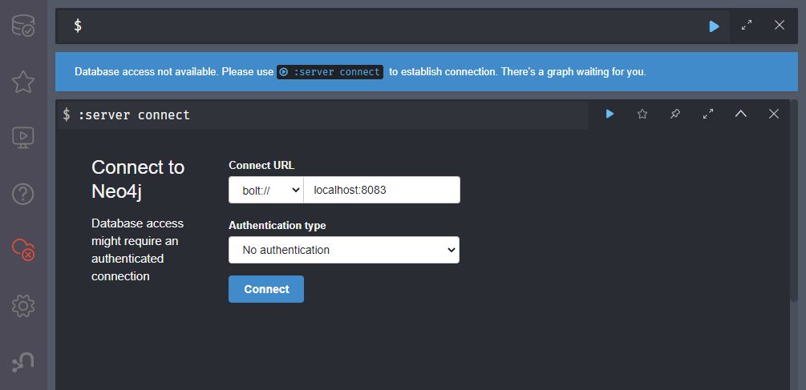
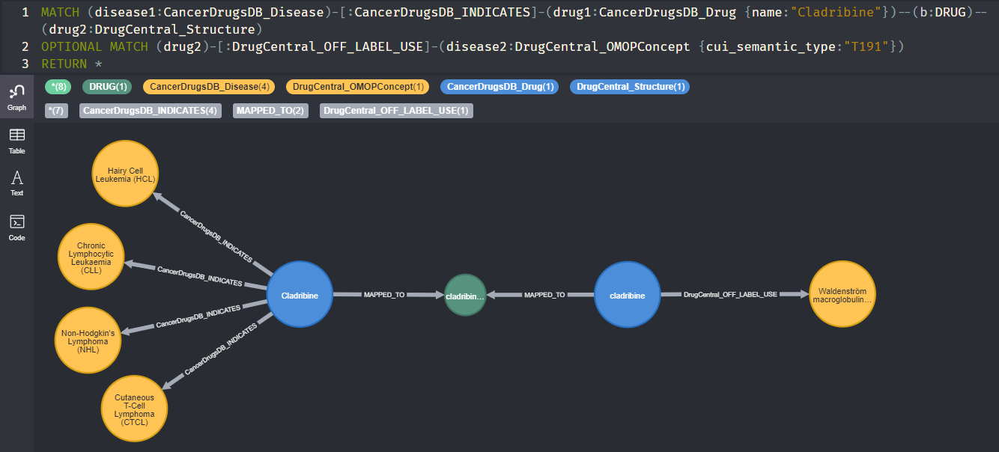

# Example
In this example use-case, we're going to integrate the data sources ```DrugCentral``` and ```CancerDrugsDB``` in a fresh workspace and run simple analysis queries in Neo4j. The goal is to provide a step by step guide from download to finish.

## Downloading the software
First, we need to download the required software. If not already present, a suitable Java Runtime Environment version 8 or higher needs to be installed.

* `BioDWH2` for the data integration can be downloaded [here](https://github.com/BioDWH2/BioDWH2/releases/latest).
* `BioDWH2-Neo4j-Server` for analysing the data warehouse in Neo4j can be downloaded [here](https://github.com/BioDWH2/BioDWH2-Neo4j-Server/releases/latest).

## Creating a workspace
Once all software is available, a new workspace can be created by running the following command in a terminal or cmd window:

> java -jar BioDWH2.jar -c /path/to/workspace

Now we're able to add both data sources to the workspace configuration:

> java -jar BioDWH2.jar --add-data-source /path/to/workspace DrugCentral

> java -jar BioDWH2.jar --add-data-source /path/to/workspace CancerDrugsDB

The configuration file in ```/path/to/workspace/config.json``` now should something like this:

```
{
  "version": 1,
  "creationDateTime": "...",
  "dataSourceIds": ["DrugCentral", "CancerDrugsDB"],
  "dataSourceProperties": { }
}
```

As we're only interested in some portions of the DrugCentral database for this example, we can speed up the integration process by skipping some of the DrugCentral data. This can be configured in the ```config.json``` as follows:

```
{
  "version": 1,
  "creationDateTime": "...",
  "dataSourceIds": ["DrugCentral", "CancerDrugsDB"],
  "dataSourceProperties": {
    "DrugCentral": {
      "skipLINCSSignatures": true,
      "skipFAERSReports": true,
      "skipDrugLabelFullTexts": true
    }
  }
}
```

## Running the data integration
After configuration, we're ready for the integration process. This can be run using the following command:

> java -jar BioDWH2.jar -u /path/to/workspace

After the integration process finished and no obvious errors have been output, we can check the status of our workspace using the status command:

> java -jar BioDWH2.jar -s /path/to/workspace

The output should look something like this:

|   SourceID    | Version is up-to-date |  Version  | new Version |  Time of latest update  | Parse successful | Export successful |
|:-------------:|:---------------------:|:---------:|:-----------:|:-----------------------:|:----------------:|:-----------------:|
|  DrugCentral  |         true          | 2020.9.18 |  2020.9.18  | 2021-05-07T13:06:51.631 |       true       |       true        |
| CancerDrugsDB |         true          |  21.4.28  |   21.4.28   | 2021-05-07T13:33:02.728 |       true       |       true        |

## Getting started with Neo4j
The workspace folder now contains the finished merged and mapped graph data warehouses. They are available at ```/path/to/workspace/sources/merged.graphml``` and ```/path/to/workspace/sources/mapped.graphml```.

However, in this example we will use the internal graph files (with ```.db``` extension) directly with the ```BioDWH2-Neo4j-Server``` tool. In order to create and start the data warehouse in Neo4j, the following commands need to be run:

> java -jar BioDWH2-Neo4j-Server.jar --create /path/to/workspace

> java -jar BioDWH2-Neo4j-Server.jar --start /path/to/workspace

This may also be combined using the ```--create-start``` parameter. However, the create process only needs to be executed if the integration process was run again such as for updates. Otherwise, ```--start``` will be sufficient afterwards.

Once the Neo4j database has been created, a browser window will automatically open with the Neo4j-Browser interface. We can connect to the running database using bolt ```bolt://localhost:8083``` without authentication.



## Exploring the data
The text field at the top can be used to write queries using the [Cypher query language](https://neo4j.com/developer/cypher/). Node and edge labels can be explored in the database explorer (first icon in the left navigation).

Nodes and edges starting with either ```CancerDrugsDB_``` or ```DrugCentral_``` are the data source nodes and edges, whereas nodes and edges without this prefix represent the mapping layer.

### Exploring the mapping between CancerDrugsDB and DrugCentral
First, we're intereted how the CancerDrugsDB drugs were mapped to DrugCentral. For this, we execute two Cypher queries to count the mapped and unmapped drugs:

```
MATCH (n:CancerDrugsDB_Drug)--(m:DRUG)
WHERE (m)--(:DrugCentral_Structure)
RETURN COUNT(n)
```

```
MATCH (n:CancerDrugsDB_Drug)--(m:DRUG)
WHERE NOT (m)--(:DrugCentral_Structure)
RETURN COUNT(n)
```

The results show, that 251 drugs from CancerDrugsDB were mapped to DrugCentral. 24 drugs could not be mapped.

To further check if the mapping is correct, we take a look at the mapped drug names in a one on one comparison:

```
MATCH (n:CancerDrugsDB_Drug)--(m:DRUG)
OPTIONAL MATCH (m)--(o:DrugCentral_Structure)
RETURN n.name, o.name
```

A small excerpt of the result looks like the following, which is looking promising.

| n.name                | o.name                           |
|-----------------------|----------------------------------|
| "Methotrexate"        | "methotrexate"                   |
| "Lapatinib"           | "lapatinib"                      |
| "Larotrectinib"       | "larotrectinib"                  |
| "Lu 177-Dotatate"     | "lutetium (177Lu) oxodotreotide" |
| "Medroxyprogesterone" | "medroxyprogesterone"            |
| "Margetuximab"        | null                             |
| ...                   | ...                              |

### Linking Off-Label-Uses from DrugCentral with CancerDrugsDB drugs
The indications of the CancerDrugsDB are currently extracted from DrugBank and filtered to exclude non-cancer indications. A possible analysis would be to link off-label-uses to the drugs listed in the CancerDrugsDB in addition to the existing indications.

DrugCentral provides connections between structures (drugs) and OMOP concepts as indications, contraindications and off-label-uses. We can filter the OMOP concepts using the [semantic type](https://bioportal.bioontology.org/ontologies/STY?p=classes&conceptid=T191) for ```T191 (neoplastic process)```.

The following query first looks a bit overwhelming. The first MATCH links CancerDrugsDB drugs with DrugCentral structures and the listed cancer indications. Optionally we MATCH off-label-use connections to OMOP concepts. We return a list of drugs for which the indications and off-label-uses are collected. 

```
MATCH (disease1:CancerDrugsDB_Disease)-[:CancerDrugsDB_INDICATES]-(drug1:CancerDrugsDB_Drug)--(:DRUG)--(drug2:DrugCentral_Structure)
OPTIONAL MATCH (drug2)-[:DrugCentral_OFF_LABEL_USE]-(disease2:DrugCentral_OMOPConcept {cui_semantic_type:"T191"})
RETURN drug1.name as cancerdrugsdb_name, drug2.name as drugcentral_name, collect(distinct disease1.name) as cancerdrugsdb_indications, collect(distinct disease2.concept_name) as drugcentral_off_label_uses
ORDER BY drug1.name
```

A result entry looks like the following:

| cancerdrugsdb_name | drugcentral_name | cancerdrugsdb_indications                                                                                                                | drugcentral_off_label_uses        |
|--------------------|------------------|------------------------------------------------------------------------------------------------------------------------------------------|-----------------------------------|
| "Cladribine"       | "cladribine"     | ["Cutaneous T-Cell Lymphoma (CTCL)", "Chronic Lymphocytic Leukaemia (CLL)", "Hairy Cell Leukemia (HCL)", "Non-Hodgkin's Lymphoma (NHL)"] | ["Waldenström macroglobulinemia"] |

As can be seen, aside from the indications, ```Cladribine``` is associated as off-label-use for the cancer [Waldenström macroglobulinemia](https://en.wikipedia.org/wiki/Waldenstr%C3%B6m%27s_macroglobulinemia).


