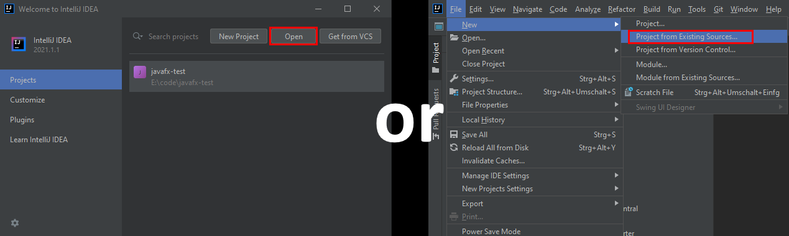
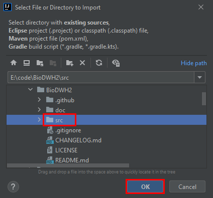
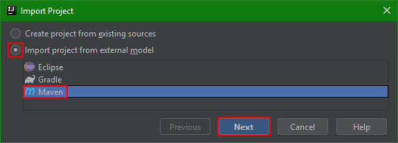
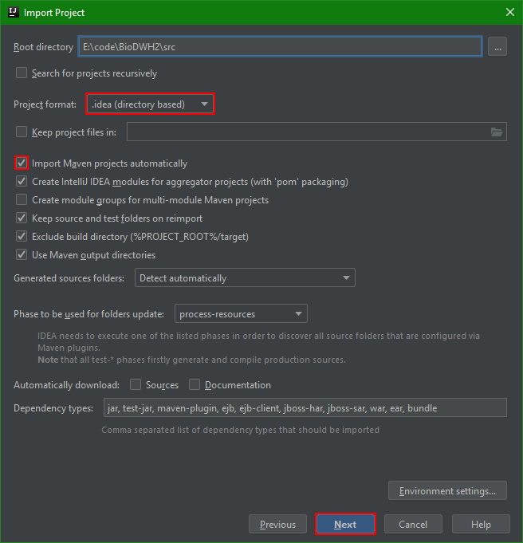
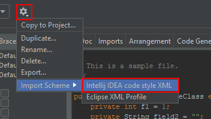
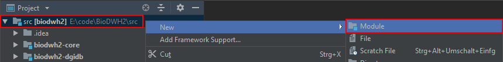
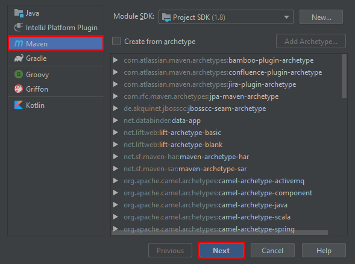
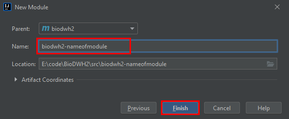
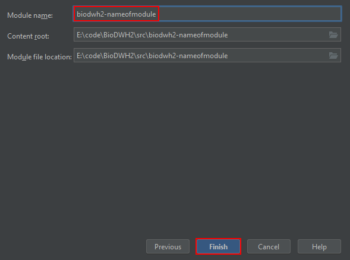

# Setup

For developing BioDWH2 in a consistent way, certain mechanisms are in place to guarantee good code quality. This includes the choice of IDE which in this case is [IntelliJ IDEA](https://www.jetbrains.com/idea/). As an open source project, BioDWH2 can be developed with the free community edition of IntelliJ.

During setup, make sure to install the following plugins:

- Maven integration
- Git integration

Alternatively, the plugins can be installed/enabled under ```Settings > Plugins```.

## Opening the maven project in IntelliJ IDEA

While BioDWH2 is a maven project, IntelliJ IDEA uses it's own project format to store additional information. The following shows how to open the project and keep the maven project intact.

First import the project from existing sources, either from the start screen with ```Import Project``` or via the menu ```File -> New -> Project from Existing Sources...```.



Browse to the checked out repository of BioDWH2 and select the ```src``` folder.



Select ```Import project from external model``` and as the model ```Maven```.



Finally, the most important part is setting the project format to ```directory based``` and to check ```Import Maven projects automatically```. This ensures the automatic sync of the project, if the maven pom.xml files change later on.



Lastly, follow through the rest of the dialogs with Next an Finish.

## Coding style setup

One of the advantages of IntelliJ IDEA is the automated code formatting. This ensures a higher code quality and less merge conflicts. Included in this repository is a coding style configuration file ([CodingStyle.xml](CodingStyle.xml)) which can be directly imported into IntelliJ IDEA. Developers and contributers of BioDWH2 need to adhere to this coding style. The import is very easy. First, go to ```Settings > Editor > Code Style > Java```. Click on the cog icon and select ```Import Scheme > Intellij IDEA code style XML```.



With the BioDWH2 scheme imported and selected, click the cog icon again, select ```Copy to Project``` and confirm the overwrite.

Now the automatic code formatting is using the BioDWH2 coding style. Formatting an open code file can be done either by the menu ```Code > Reformat Code``` or the shortcut ```Strg + Alt + L```.

## Creating a new parser module

Creating a new parser module is pretty simple, but for consistency we go through the steps in short. First, right click the project ```src``` folder and select ```New > Module```.



Second, select ```Maven``` as the module type and click ```Next```.



Now enter the artifact id for the new module, all other values are inherited. The artifact id follows the structure ```biodwh2-[a-z]+``` where the suffix is unique and identifying the data source that is processed in this module. Click ```Next```.



The module name by default removes the ```-``` character, please make sure to add it again to match the artifact id. Click ```Finish```.



Now your new module should be created and added to the module list. Open the ```pom.xml``` of your module and add the dependencies for the ```biodwh2-core``` module and the ```junit``` unit testing library as follows:


Finally, make sure to add the package structure in your modules ```src > main > java``` like ```de.unibi.agbi.biodwh2.yourmodulename``` and follow the package structure like the other parser modules.
