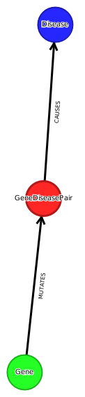

# Gene2Phenotype

G2P is a publicly-accessible online system designed to facilitate the development, validation, curation and distribution of large-scale, evidence-based datasets for use in diagnostic variant filtering. Each G2P entry associates an allelic requirement and a mutational consequence at a defined locus with a disease entity. A confidence level and evidence link are assigned to each entry.

## Website

[ebi.ac.uk/gene2phenotype](https://www.ebi.ac.uk/gene2phenotype)

## License

Apache License 2.0

## Files used

  * ```CancerG2P.csv.gz```
  * ```DDG2P.csv.gz```
  * ```EyeG2P.csv.gz```
  * ```SkinG2P.csv.gz```

## Current Graph

