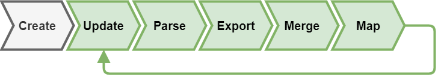

# Documentation

## Introduction

BioDWH2 is an easy-to-use, automated, graph-based data warehouse and mapping tool for bioinformatics and medical informatics. The latest version can be downloaded [here](https://github.com/BioDWH2/BioDWH2/releases/latest).

The workflow of BioDWH2 is split into several distinct steps as follows:



1. First, a new project workspace has to be created in which all data sources will be stored and processed. This step is done once per project and all subsequent steps run in this workspace. More on the workspace concept will follow below.
2. Configured data sources need to be updated, meaning BioDWH2 checks which is the newest available version online and compares it to the current version stored in the workspace. If no version has been stored or a new one is available, the data files are being downloaded to the workspace.
3. After the update step follows the parsing of the raw data files, loading them into memory.
4. Once loaded, the information are transformed and exported into a suitable graph structure representation.
5. After all data sources finished exporting, the resulting graphs are merged into one big graph.
6. Finally, this singular graph is then used in combination with the data source modules to describe entities and relationships. These descriptions result in the creation of nodes and relationships in a mapping layer on top of the existing graph. This mapping layer connects the heterogeneous data sources and helps uncover new and meaningful information.
7. The process can be executed repeatedly and whenever the user sees fit.

## The workspace

BioDWH2 is centered around the concept of a workspace containing all data sources, configurations and outputs in one central location. This enables all data to be available during processing and easy to backup if necessary.

The basic file structure is visualized below:

```
.
+-- config.json
+-- sources
|   +-- DrugBank
|   |   +-- source
|   |   |   +-- drugbank_all_full_database.xml.zip
|   |   |   +-- drugbank_all_metabolite-structures.sdf.zip
|   |   +-- intermediate.graphml
|   |   +-- meta-graph.png
|   |   +-- meta-graph-statistics.txt
|   |   +-- metadata.json
|   +-- HGNC
|   |   +-- source
|   |   |   +-- hgnc_complete_set.txt
|   |   +-- intermediate.graphml
|   |   +-- meta-graph.png
|   |   +-- meta-graph-statistics.txt
|   |   +-- metadata.json
|   ...
|   +-- merged.graphml
|   +-- merged-meta-graph.png
|   +-- merged-meta-graph-statistics.txt
|   +-- mapped.graphml
|   +-- mapped-meta-graph.png
|   +-- mapped-meta-graph-statistics.txt
```

## Requirements

BioDWH2 requires the Java Runtime Environment version 8 to be installed. The JRE 8 is available [here](https://www.oracle.com/java/technologies/javase-jre8-downloads.html).

## Creating a workspace

> :warning: **Please note**: The following commands refer to the BioDWH2 executable as `BioDWH2.jar` for simplicity. The file name of the release downloads is versioned such as `BioDWH2-v0.1.7.jar`.

The first step is to create a blank workspace in a new location using the `-c` or `--create` command line parameter.

~~~BASH
$ java -jar BioDWH2.jar -c /path/to/workspace
~~~

## Configuring workspace data sources

After creation, the workspace is configured without any data sources. Adding and removing data sources to the workspace can be done either using the command line or directly in the `config.json` file. All available data source IDs can be listed using the following command:

~~~BASH
$ java -jar BioDWH2.jar --data-sources
~~~

Adding and removing via the command line can be done using the following commands:

~~~BASH
$ java -jar BioDWH2.jar --add-data-source /path/to/workspace HGNC
$ java -jar BioDWH2.jar --remove-data-source /path/to/workspace HGNC
~~~

Alternatively open the `config.json` in your workspace with any text editor and add the data source IDs inside the square brackets of the `dataSourceIds` field. Following is an example of a config file with two data sources:

```
{
  "version" : 1,
  "creationDateTime" : "2019-09-26T09:30:36.568",
  "dataSourceIds" : ["HGNC", "MED-RT"],
  "dataSourceProperties": {}
}
```

## Executing the workflow

Now, the workspace can be automatically updated, parsed, exported, merged, and mapped:

~~~BASH
$ java -jar BioDWH2.jar -u /path/to/workspace
~~~

## Checking for updates

To check the current state of the workspace, whether new versions are available, something is missing, etc. the `-s` or `--status` command line parameter can be used.

~~~BASH
$ java -jar BioDWH2.jar -s /path/to/workspace
~~~

## Analyzing the data

After creating and processing the workspace, the resulting graph can be analyzed. For a detailed guide on analysis tasks, check [here](analysis.md).

## Task command line parameters

| Short parameter | Long parameter        | Values                           | Description                                 |
| --------------- | --------------------- | -------------------------------- | ------------------------------------------- |
| -h              | --help                | -                                | Print the help message                      |
| -c              | --create              | \<workspacePath>                 | Create a new empty workspace                |
|                 | --data-sources        | -                                | List all available data sources             |
|                 | --add-data-sources    | \<workspacePath> \<dataSourceId> | Add a data source to the configuration      |
|                 | --remove-data-sources | \<workspacePath> \<dataSourceId> | Remove a data source from the configuration |
| -u              | --update              | \<workspacePath>                 | Update all data sources of a workspace      |
| -s              | --status              | \<workspacePath>                 | Check and output the state of a workspace   |
|                 |                       |                                  |                                             |

## Additional command line parameters

| Short parameter | Long parameter        | Values                           | Description                                 |
| --------------- | --------------------- | -------------------------------- | ------------------------------------------- |
|                 | --skip-update         | -                                | Skip update, only parse and export          |
| -v              | --verbose             | -                                | Enable additional logging output            |
|                 |                       |                                  |                                             |

## Complete configuration file schema
```
{
  "version" : int,
  "creationDateTime" : string,
  "dataSourceIds" : [string, string, ...],
  "skipGraphMLExport": boolean,
  "skipMetaGraphGeneration": boolean,
  "dataSourceProperties": {
    "DrugBank": {
      "forceExport": boolean,
      "username": string,
      "password": string
    },
    "DrugCentral": {
      "forceExport": boolean,
      "skipDrugLabelFullTexts": boolean,
      "skipLINCSSignatures": boolean,
      "skipFAERSReports": boolean
    },
    "...": {
      "forceExport": boolean
    }
  }
}
```